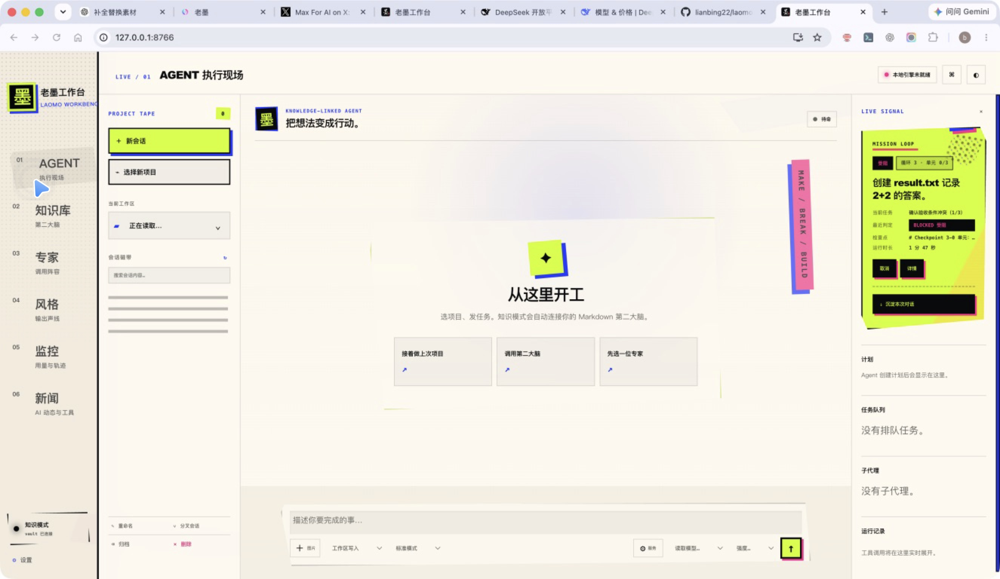
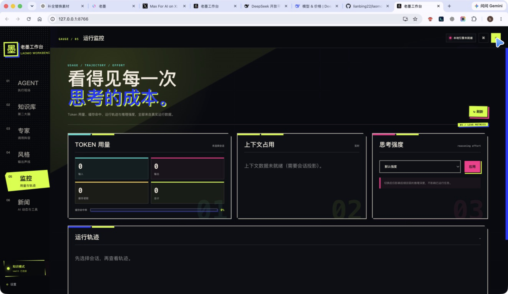
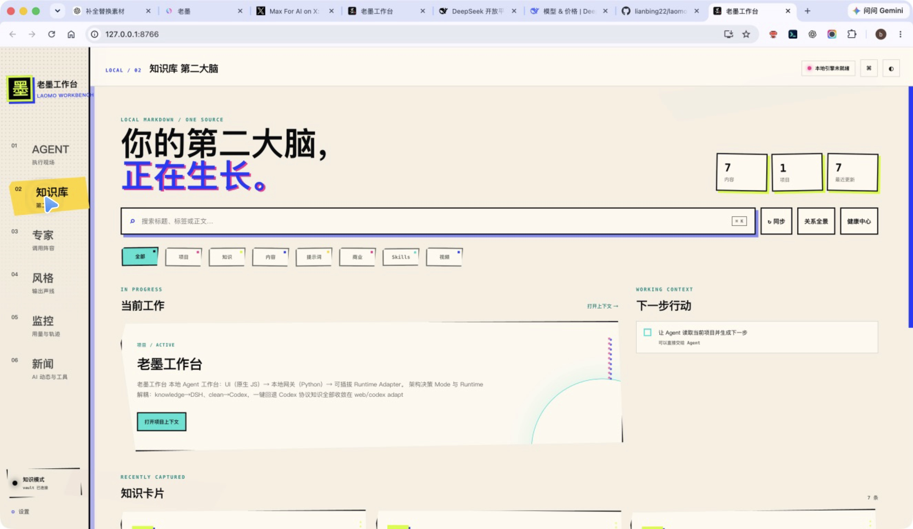
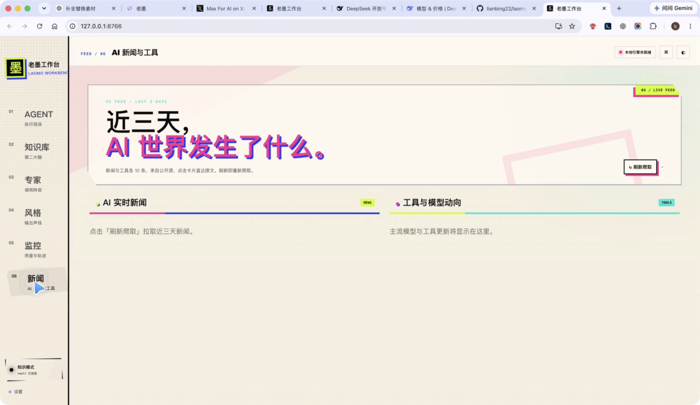

# 老墨工作台

<strong>本地 Agent 工作台 · Mission 控制面 · 知识库 · 可观测运行轨迹</strong>

  <a href="README_EN.md">English</a> ·
  <a href="docs/mission-contract.md">Mission Contract</a> ·
  <a href="docs/provider-contract.md">Provider Contract</a> ·
  <a href="SECURITY.md">Security</a>

把 Agent 从一次性聊天，推进到可追踪、可恢复、可复盘的本地执行工作流。

  

> 这是一个本地优先的 Agent 工作台，不是普通聊天套壳，也不是云端多租户平台。核心目标是把项目上下文、专家方法、输出风格、Mission 计划、执行状态和运行成本放进同一套工作面。

## 这是什么

老墨工作台（Boujoy Harness）面向需要长期使用 Agent 的个人开发者和小团队，解决的是“上下文散落、任务不可追踪、失败无法解释、执行结果难复盘”这类问题。

工作台目前包含：

- Agent 执行现场：创建会话、选择项目、调用模型、查看任务过程。
- 本地知识库：以 Markdown 为主的项目资料、知识卡片和工作上下文。
- 专家与风格：可组合的调用角色和输出约束。
- 运行监控：Token、上下文、思考强度、轨迹和运行状态。
- AI 新闻与工具：轻量的外部信息入口，不把它伪装成项目核心能力。
- Mission 控制面：将计划拆成有依赖关系的 Unit，交给 Worker 执行，再进行 Integration。

## 主要能力

| 能力 | 现在能做什么 | 适合解决的问题 |
| --- | --- | --- |
| Agent 工作台 | 本地会话、项目上下文、模型调用、任务输入和输出 | 日常开发、资料整理、复杂任务执行 |
| Knowledge | Markdown 检索、知识卡片、项目资料入口 | 减少重复解释，让 Agent 读取已有上下文 |
| Experts | 创建、编辑、复制、删除和调用专家配置 | 固定审查、架构、写作或排错方法 |
| Styles | 创建和切换输出风格 | 让不同任务保持稳定的表达和格式 |
| Monitor | 查看 Token、上下文、推理强度和运行轨迹 | 判断任务是否卡住、成本是否异常 |
| Mission | plan.json、DAG、UnitRunner、Worktree、并行调度和集成恢复 | 把长任务变成可追踪的执行单元 |
| News | 手动刷新公开 RSS 新闻 | 了解近期 AI 工具和模型动态 |

## 页面地图

左侧工作区按六个入口组织：

1. AGENT：执行现场，处理当前会话和任务。
2. 知识库：项目资料、知识卡片和工作上下文。
3. 专家：可调用的角色与方法。
4. 风格：输出语气、结构和格式约束。
5. 监控：运行指标和轨迹。
6. 新闻：AI 动态与工具入口。

右上角的本地引擎状态、主题切换和设置入口属于全局控制，不依赖某一个页面。

## 产品截图

### 执行与监控

| Agent 执行现场 | 运行监控 |
| --- | --- |
|  |  |

### 知识与信息

| 知识库 | AI 新闻与工具 |
| --- | --- |
|  |  |

### 配置与终态

- Mission 受阻终态：[agent-mission-blocked.jpg](docs/screenshots/agent-mission-blocked.jpg)
- 模型服务列表：[provider-list.jpg](docs/screenshots/provider-list.jpg)
- 新建模型服务表单：[provider-form.jpg](docs/screenshots/provider-form.jpg)
- 监控页亮色主题：[monitor-page-light.jpg](docs/screenshots/monitor-page-light.jpg)
- 完整 UI 迭代素材：[docs/screenshots/ui-refinement-1.0/](docs/screenshots/ui-refinement-1.0/)
- 现有演示动图：[docs/assets/harness-demo.gif](docs/assets/harness-demo.gif)

## Quick Start

### 环境要求

- macOS、Linux 或 Windows
- Python 3
- Git
- 如果要使用 Codex clean runtime，需要本机已安装并可调用 Codex
- 基础本地模式不要求先安装前端包管理器，也不要求启动数据库

### 启动本地工作台

~~~bash
git clone https://github.com/lianbing22/laomoworkbench.git
cd laomoworkbench

python3 web/boujoy_server.py \
  --port 8766 \
  --vault vault \
  --static web \
  --clean-runtime dsh
~~~

然后打开：

~~~text
http://127.0.0.1:8766
~~~

`--vault` 可以替换为你的 Markdown 知识库目录。第一次启动时如果目录不存在，先手动创建即可：

~~~bash
mkdir -p vault
~~~

### 使用 Codex clean runtime

~~~bash
python3 web/boujoy_server.py \
  --port 8766 \
  --vault vault \
  --static web \
  --clean-runtime codex
~~~

`dsh` 是默认的本地运行模式；`codex` 需要本机 Codex runtime 和对应的 app-server 能力。两种模式都由本地网关统一承接页面请求，具体 Provider 配置以设置页和本地配置为准。

### Windows

Windows 入口和打包说明见：

- [Windows 使用说明](windows/README-Windows.zh-CN.md)
- [Windows 发布状态](windows/WINDOWS-RELEASE-STATUS.md)

可以直接使用仓库内的 `启动 Boujoy Harness.cmd`，停止时使用 `关闭 Boujoy Harness.cmd`。

### 局域网访问

可以通过 `--access-code` 增加轻量入口保护：

~~~bash
python3 web/boujoy_server.py \
  --port 8766 \
  --vault vault \
  --static web \
  --clean-runtime dsh \
  --access-code your-code
~~~

省略 `--access-code` 时，服务按本地使用处理。Access code 不是完整的多用户身份系统；不要把本地工作台直接暴露到公网。

## 运行模式

| 模式 | 默认 | 用途 | 注意 |
| --- | --- | --- | --- |
| dsh | 是 | 本地默认运行链路，适合快速启动和开发 | 依赖本机可用的 DSH 运行环境 |
| codex | 否 | 使用 Codex app-server 适配器执行 | 需要本机 Codex runtime |

服务端入口是 `web/boujoy_server.py`，前端是 `web/index.html`、`web/app.js` 和 `web/app.css`。页面不单独启动另一套前端开发服务器。

## Mission 当前状态

当前主线已经包含 P1.2 的 M0–M5 基础闭环：

| 里程碑 | 已实现内容 | 状态 |
| --- | --- | --- |
| M0 | Mission 包、模型、存储和基础契约 | 已完成 |
| M1 | plan.json v2、Unit id、dependencies、DAG 校验和依赖感知调度 | 已完成 |
| M2 | UnitRunner 单元执行层 | 已完成 |
| M3 | 每个 Unit 独立 Git worktree，Integration 串行合并 | 已完成 |
| M4 | 依赖就绪、Lease、并发 Worker 调度，最大并行数硬上限为 4 | 已完成 |
| M4.1 | 按 jobId 唤醒的 Condition mailbox，减少无效轮询和竞态 | 已完成 |
| M5 | Integration 写前记录、崩溃恢复、plan.json 与 Git 状态 reconcile | 已完成 |

### 仍然明确没有完成的部分

文档不把规划当成产品能力，以下边界需要保留：

- Merge 冲突可以被检测、终止并把 Mission 标记为阻塞；自动 Conflict Resolver 还没有接入。
- 当前是单 Mission 控制面，Multi-Mission Scheduler 尚未接入工作台。
- Planner、Worker、Evaluator 的 Provider 角色路由还不是完整的多角色编排产品。
- Vault、专家和风格上下文到 Codex clean runtime 的全量注入仍需继续收口。
- 远程 daemon、WebSocket、多用户权限和生产级审计不属于当前默认交付范围。
- Mission 的真实 live runtime 验证依赖本机运行环境；静态测试通过不等于端到端运行完成。

`blocked` 是一种明确的执行终态：它表示当前任务在现有条件下无法继续满足，不等同于程序崩溃，也不应该被 UI 隐藏。

## 架构概览

~~~text
Browser
  |
  v
web/index.html + app.js + app.css
  |
  v
web/boujoy_server.py
  |-- local file and vault access
  |-- provider and clean-runtime adapters
  |-- mission API
  |
  v
web/mission/
  |-- models.py       plan and unit models
  |-- dag.py          dependency validation
  |-- store.py        plan persistence
  |-- unit_runner.py  one-unit execution
  |-- jobs.py         job lifecycle and mailbox
  |-- manager.py      scheduler and integration reconcile
  |-- worktree.py     isolated Git worktrees and recovery
  |-- verification.py result checks
~~~

核心设计原则：

- 本地优先：页面、网关、任务状态和知识库都以本地运行作为默认路径。
- 可解释：每个 Unit 有状态、依赖、尝试次数和结果，不把黑盒等待当成“成功”。
- 可恢复：Integration 有写前记录和 reconcile 路径，进程中断后可以恢复或明确阻塞。
- 可验证：计划校验、状态机、工作树和运行结果分开检查。
- 有边界：没有实现的远程编排、多用户和自动冲突解决，不在 README 里装成已经存在。

## 本地数据与安全边界

- vault 是本地知识库目录，适合放项目 Markdown 和可公开给本地 Agent 的资料。
- Provider 配置和访问凭据应通过本地设置或环境变量管理，不要提交到 Git，不要写进截图和日志。
- AI News 页面会请求服务端列出的公开 RSS；它不是项目知识库，也不代表内容已经被事实核验。
- access code 只提供轻量入口保护，不替代完整认证、授权、审计和网络隔离。
- 使用第三方模型 Provider 时，发送到 Provider 的内容由你的模型配置和任务输入决定；提交敏感资料前先确认 Provider 的数据政策。
- 详见 [SECURITY.md](SECURITY.md)。

## 开发与验证

语法检查：

~~~bash
node --check web/app.js
~~~

离线 smoke test：

~~~bash
env PYTHONDONTWRITEBYTECODE=1 python3 tests/smoke_test.py --skip-live
~~~

Git diff 检查：

~~~bash
git diff --check
~~~

如果要验证 Mission 运行时，请同时检查：

1. server 是否成功启动。
2. 页面是否能加载并读取本地状态。
3. Unit 是否从 queued 进入 running、completed 或 blocked。
4. worktree 和 Integration 的 Git 状态是否与 plan.json 一致。
5. 真实 Provider 或 clean runtime 是否返回了可识别结果。

不要只用 HTTP 200、文件存在或静态测试通过来宣称 Mission 已经跑通。

## 目录结构

~~~text
web/
  boujoy_server.py       本地网关
  index.html             页面骨架
  app.js                 前端交互和 API 调用
  app.css                全局视觉系统
  mission/               Mission 控制面

docs/
  mission-contract.md    Mission 契约
  provider-contract.md   Provider 契约
  screenshots/           实测截图和 UI 迭代素材
  assets/                演示资产

tests/                    smoke、DAG、Provider、Codex 和 Mission 测试
macos/                    macOS 应用和 portable runtime 说明
windows/                  Windows 启动与打包脚本
assets/                   图标、字体和视觉资源
~~~

## 路线图

下一阶段按真实交付优先级推进：

1. 收口 Mission 的 live runtime 验证和长任务恢复证据。
2. 补上可控的冲突处理流程，再评估是否引入自动 Conflict Resolver。
3. 将 Planner、Worker、Evaluator 的角色路由接入统一 Provider 契约。
4. 继续完善知识库、专家和风格上下文的注入与来源标记。
5. 在明确认证、权限、审计和部署边界后，再考虑远程 daemon 与多用户能力。

## 常见问题

### 这是一个在线 SaaS 吗？

不是。默认是本地工作台，本地网关承接页面和任务状态。模型调用是否经过第三方 Provider，取决于你的本地配置。

### dsh 和 codex 怎么选？

想快速启动就用默认的 dsh；需要走 Codex app-server 适配器时显式指定 clean-runtime codex。

### 为什么 Mission 会显示 blocked？

blocked 表示依赖、执行条件、验证结果或 Integration 冲突让任务无法继续。它是可解释的终态，应该查看任务详情和运行轨迹，而不是简单重试。

### 可以把它当成团队协作平台吗？

当前不应该。它适合本地个人和小团队工作流；多用户、权限、远程调度和生产审计还没有作为默认能力交付。

## License

项目代码遵循 [LICENSE](LICENSE)。字体和第三方资产遵循各自目录内的许可说明。
