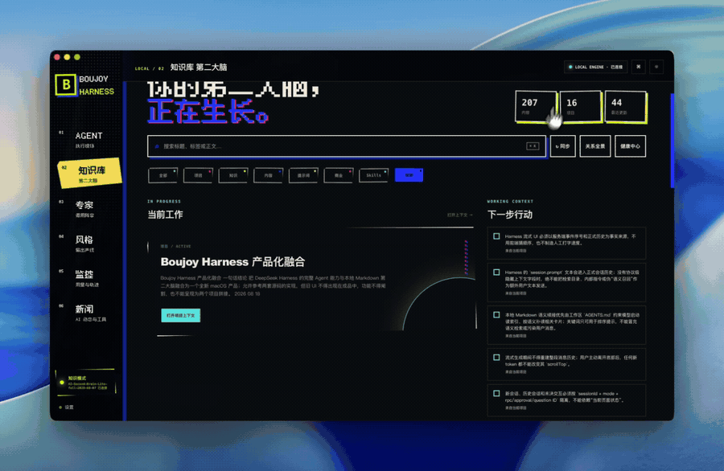

# 老墨工作台

## LAOMO WORKBENCH

**把 Agent 从聊天框里拽出来，接进你的本地工作区。**

一个本地优先的 Agent 工作台：会话、任务、知识库、运行信号，都是你自己的文件和你自己的机器。

[English](README_EN.md) · 基于 [Boujoy Harness](https://github.com/asen-goat-mine/boujoy-harness) 二次开发

  

## 它是什么

老墨工作台是一个跑在你本机的 Agent 工作台。它不托管模型、不保存你的凭据到云端：Agent Runtime（默认 [DeepSeek Harness](https://github.com/deepseek-ai/deepseek-harness)）跑在你自己的机器上，工作上下文留在你自己的文件夹里。

一句话分工：

- **Agent Runtime** 负责让 Agent 真正行动（模型调用、工具、事件流）。
- **老墨工作台** 负责让行动有工作区、有可视化、有可恢复的桌面体验。
- **Markdown Vault** 负责把值得长期复用的上下文留在你自己的文件里。

~~~text
你的一句话任务
        │
        ▼
老墨工作台 UI ── 本地网关 ── Agent Runtime ── 你配置的模型 / 工具
        │
        └────────────── 本地 Markdown Vault
                         项目 · 知识 · 提示词 · 内容
~~~

## 核心能力

| 能力 | 说明 |
| --- | --- |
| 可插拔 Agent Runtime | 纯净模式默认 Codex（`codex app-server --stdio`），知识模式 DSH；`--clean-runtime` 一键切换，模式与引擎解耦。 |
| 模型与推理强度 | 模型列表/五档推理等级（low~max）来自 Codex 真实目录，输入框旁即选即生效。 |
| 沙箱权限 | 只读/工作区写入/完全访问三档，映射 Codex 沙箱策略，实时回读生效。 |
| 目标与计划 | 设定目标自动驱动 Agent；计划步骤实时勾选；工具活动卡片实时展开。 |
| Markdown 工作区 | 项目、知识、提示词与内容资料留在你拥有的文件夹，而不是云端数据库。 |
| 长对话可用性 | 历史分页加载、流式投影与用户滚动分离，完成后自动切换富文本渲染。 |
| 任务与中断交互 | 审批/提问队列化处理；运行中可引导（steer）或打断（interrupt）。 |
| 本地优先 | 未配置访问码时只绑定本机回环地址；无遥测。 |
| 跨平台 | macOS 13+ Apple Silicon 原生桌面宿主；Windows 10/11 x64 浏览器宿主（Beta）。 |

## 从源码启动（macOS）

前置条件：macOS 13+ Apple Silicon、Python 3、已单独构建好的 DeepSeek Harness（存在可执行的 `node_modules/.bin/dsh`）、一个本地 Markdown Vault 目录。

~~~bash
git clone https://github.com/lianbing22/laomoworkbench.git
cd laomoworkbench

# 指向你自己的本机依赖；不要把这些值提交进 Git
export BOUJOY_DSH_ROOT="$HOME/src/deepseek-harness"
export BOUJOY_VAULT_DIR="$HOME/BoujoyVault"
export BOUJOY_PYTHON_BIN="$(command -v python3)"

./macos/build-app.command --install
~~~

不想装原生壳，也可以直接跑 Web 版（纯净模式即可用）：

~~~bash
mkdir -p vault
python3 web/boujoy_server.py --port 8766 --vault vault --static web
# 打开 http://127.0.0.1:8766/
~~~

首次使用：左侧选择或创建工作区 → 连接你的 Markdown Vault（纯净模式跳过）→ 在输入框描述任务。模型、Provider 与工具权限由你配置的 Agent Runtime 决定。

## 知识模式与纯净模式

| 模式 | 适合 | 不做什么 |
| --- | --- | --- |
| 知识模式 | 有项目背景、文档、提示词或历史决策需要复用的任务 | 不会把整个 Vault 无差别塞给模型；由索引和相关卡片按需提供上下文。 |
| 纯净模式 | 临时问答、实验、不使用工作资料的场景 | 不读取你的 Markdown Vault。 |

公开源码不附带个人 Vault，从空目录开始即可。

## 路线图

**P0 已落地**：Runtime 层已完成解耦，纯净模式由 Codex app-server 驱动（12+2 项真实验收全过），知识模式保持 DSH，一条参数即可回退——详见 [CHANGELOG.md](CHANGELOG.md)。

下一步（P1）：

~~~text
                老墨工作台
                    │
        ┌───────────┴───────────┐
   产品控制层                工作台 UI
        │
  RuntimeAdapter
        │
  ┌─────┼─────────────┐
  │     │             │
Codex  DeepSeek     Claude/GLM
~~~

- Vault → Codex：把知识库/专家卡变成 Codex 可消费的上下文层，知识模式切换到 Codex。
- 任务队列与子代理面板（由老墨控制层拥有，不绑死任何引擎）。
- 更多 Runtime Provider（Claude/GLM）。

## 常见问题

**为什么提示缺少运行组件？** 确认本机的 Agent Runtime、Vault 和 Python 路径真实存在。使用便携包时从「启动」脚本启动，不要直接双击 App。

**为什么启动页停留较久？** 首次运行要等本地网关和 Runtime 的健康检查，不是卡死。失败时检查本地 runtime、Python 和 Provider 配置。

**为什么 Agent 没有回复？** 本项目不托管模型余额或 API Key，从你的 Agent Runtime 侧检查模型 Provider、余额、网络与权限。

**知识库预览不可用会影响聊天吗？** 不会。知识预览是可选服务，缺失时主 Agent 界面继续可用。

**这是 DeepSeek 或 OpenAI 的官方产品吗？** 不是。老墨工作台是独立的非官方开源产品层。

## 隐私与网络边界

- Vault 内容、会话状态和凭据留在本机；本仓库不包含这些数据。
- 未配置访问码时本地网关只绑定 127.0.0.1；局域网访问需显式配置访问码。
- AI 新闻页面请求 `web/boujoy_server.py` 中列出的公开 RSS；无分析、无遥测。
- 永远不要提交个人 Vault、会话记录、凭据或平台 runtime。

详细安全说明见 [SECURITY.md](SECURITY.md)。

## 验证与开发

不需要模型账户即可运行静态 smoke test：

~~~bash
env PYTHONDONTWRITEBYTECODE=1 python3 tests/smoke_test.py --skip-live
~~~

若本机已有运行中的实例（含 Agent Runtime）：

~~~bash
python3 tests/smoke_test.py --live-origin http://127.0.0.1:8766
~~~

## 仓库内容

~~~text
macos/      macOS 原生 WKWebView 宿主与构建脚本
web/        本地网关、Web UI 与资源
windows/    Windows 浏览器宿主 Beta 脚本与说明
tests/      不依赖模型的 smoke test
assets/     图标、字体归属与视觉资源
~~~

## 许可与致谢

本仓库基于 [Boujoy Harness](https://github.com/asen-goat-mine/boujoy-harness)（MIT License）二次开发，遵循其许可证条款；上游又基于 [DeepSeek Harness](https://github.com/deepseek-ai/deepseek-harness) 构建。字体归属与第三方信息见 [THIRD_PARTY_NOTICES.md](THIRD_PARTY_NOTICES.md)。

「老墨工作台 / LAOMO WORKBENCH」为本项目自己的品牌，与 DeepSeek AI、OpenAI 无关联、不受其背书。
