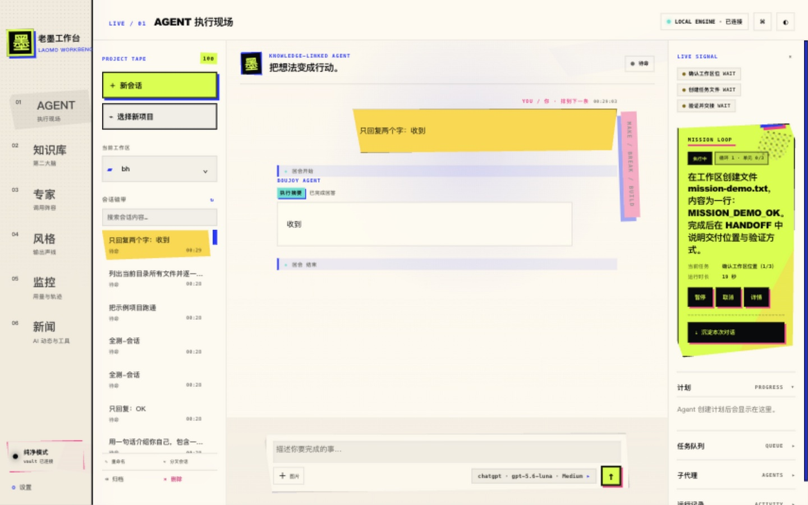

<div align="center">

# 老墨工作台 · LAOMO WORKBENCH

<p><strong>本地优先的 Agent 工作台 · 双运行时 · Mission 编排引擎 · 全程可复盘</strong></p>

<p>
  <a href="README_EN.md">English</a> ·
  <a href="docs/mission-contract.md">Mission Contract</a> ·
  <a href="docs/provider-contract.md">Provider Contract</a> ·
  <a href="docs/codex-protocol-notes.md">Codex Protocol Notes</a> ·
  <a href="SECURITY.md">Security</a>
</p>

<p>把 Agent 从一次性聊天，推进到<strong>可追踪、可恢复、可验证、可复盘</strong>的本地执行工作流。</p>

</div>

<p align="center">
  
</p>

> 老墨工作台不是聊天套壳，也不是云端多租户平台。它运行在你自己的 Mac 上：模型凭据进钥匙串、任务状态落磁盘、Git 集成不碰你的检出分支、所有执行证据可离线审计。

---

## 核心能力

| 能力 | 说明 |
| --- | --- |
| **双运行时** | 知识模式（DSH，连接 Markdown 第二大脑）与纯净模式（Codex `app-server`，项目隔离）一键切换；模式与运行时解耦（`RuntimeManager`） |
| **Mission 编排引擎** | 目标 → 自动规划多单元 DAG → 并行执行（`maxParallelWorkers`）→ 单元评估 → Git 集成事务 → 冲突解决 → 机器验收 → 终评 → DONE，全程持久化、可恢复 |
| **权限分级** | 只读 / 工作区写入（询问）/ **全自动（免批准，沙箱内）** / 完全访问（无沙箱）；Mission 回合默认无人值守契约 |
| **工作模式** | 聊天 / 计划（只规划不执行，自动切只读）/ 自动（自主执行到底，自动切全自动） |
| **多项目管理** | 原生选框添加项目（⌘O）、重命名/排序/移除、会话按目录自动分组、Finder 一键定位 |
| **模型服务管理** | 供应商配置（内置 ChatGPT / 自定义 OpenAI 兼容端点）、密钥只进 macOS 钥匙串、连接测试、按模型选择推理强度 |
| **可观测运行** | 目标（goal）自动驱动、计划（plan）、Token/上下文压力、工具轨迹、后台任务等待-唤醒（LAOMO_JOB 协议） |
| **产物预览** | `/api/preview?path=…` 沙箱化预览 Agent 生成的页面；直接粘贴绝对路径也能打开（自动识别） |
| **本地服务** | 知识库检索、专家/风格库、AIHOT 等新闻聚合，全部本地缓存 |

## 快速开始

### 环境要求

- macOS（Windows 有实验性启动脚本）
- Python 3.9+（系统自带 `/usr/bin/python3` 即可，零第三方依赖）
- [Codex CLI](https://github.com/openai/codex) ≥ 0.149，已 `codex login`（ChatGPT 账号）
- 可选：DSH 知识引擎（`deepseek-harness`，端口 3080）——不装则工作台自动回退纯净模式

### 启动

```bash
git clone https://github.com/lianbing22/laomoworkbench.git
cd laomoworkbench

# 纯净模式（Codex 运行时）
/usr/bin/python3 web/boujoy_server.py --port 8766 --vault vault --static web --clean-runtime codex

# 知识模式另需在 3080 启动 DSH：
# cd <deepseek-harness> && DSH_HOME=$PWD/.dsh pnpm dsh web --host 127.0.0.1 --port 3080
```

浏览器打开 <http://127.0.0.1:8766/>。

首次使用建议：

1. 点「选择新项目」（⌘O）用系统选框把你的项目目录加进来；
2. 在输入框的模型摘要条里展开高级面板，把权限切到「全自动（免批准）」；
3. 小任务直接聊；大任务用「计划」模式先出方案，确认后切「自动」执行；
4. 需要长链路无人值守时，创建 Mission（自然语言目标 + 验收标准）。

### 用 Mission 跑一个真实任务

在 Agent 页把对话切到 Mission 模式，给出目标与验收标准即可。控制面会：

- 规划出 3–6 个并行单元（DAG 依赖，`maxParallelWorkers=2`）；
- 每个单元在独立 worktree 分支 `laomo/<mission_id>/u<N>` 上执行；
- 集成走独立事务分支 `laomo/<mission_id>/integration`（**绝不触碰你检出的分支**）；
- 内容冲突由专用 Conflict Resolver 回合解决（禁止 git 写操作，控制面收尾）；
- 机器验收逐条跑检查，终评通过才允许 DONE，证据清单（diff、结果、事件流）落 `.laomo/runs/<id>/`。

详细契约见 [docs/mission-contract.md](docs/mission-contract.md)。

## 架构

```
浏览器 (web/ 静态前端)
   │  HTTP + WebSocket（同源，回环）
   ▼
web/boujoy_server.py  本地网关（Python 标准库，无第三方依赖）
   ├─ RuntimeManager         模式 ⇄ 运行时解耦
   │    ├─ knowledge → DSH HTTP 代理 (127.0.0.1:3080)
   │    └─ clean     → web/codex_adapter.py → codex app-server --stdio
   ├─ mission/      Mission 控制面（规划/调度/集成事务/验收/恢复）
   ├─ provider_profile.py   供应商档案 + 钥匙串凭据
   └─ /api/preview  沙箱化产物预览（CSP sandbox，无法触碰网关 API）
```

状态与证据落盘位置：

- Mission 运行态：`<workspace>/.laomo/runs/<mission_id>/`（manifest/state/plan/events/jobs/verdicts/verification）
- 工作台宿主状态（多项目/设置/预设）：`~/Library/Application Support/Boujoy/BoujoyHarness/host-state.json`
- 供应商档案：同目录 `providers.json`；密钥只在 macOS 钥匙串（服务名 `laomo-workbench-provider`）

## API 一览（本地回环）

| 路由 | 用途 |
| --- | --- |
| `GET /api/health` | 网关与双运行时健康（DSH 端口真实探测，ready/down 如实上报） |
| `POST /api/harness/{knowledge\|clean}/<method>` | DSH 形状的 RPC 面（会话/模型/权限/预设/凭证/工作区…） |
| `POST /api/missions/{create\|start\|pause\|resume\|cancel\|status\|list}` | Mission 控制面 |
| `GET /api/preview?path=<相对或绝对路径>` | 工作目录内文件预览（目录给索引页） |
| `GET /api/providers…` | 供应商 CRUD/激活/测试 |

## 测试与质量门禁

- 单元/集成测试：**166 项全绿**（`/usr/bin/python3 -m pytest tests/ -q`，仓库根执行）
- 真实 Codex 门禁（`scripts/gate_p12_driver.py`、`scripts/gate_p12_runtime_concurrency.py`）：Gate 0/A/B/C/D/E/F/G/H/I/J + Usability 验收**全部 PASS**，覆盖并行执行、依赖屏障、冲突解决、长任务等待-唤醒、暂停恢复、取消中断、SIGKILL 崩溃恢复、集成事务楔死恢复、机器验收修复、终评排序与证据清单
- 纪律：门禁先真跑、相信证据、FAIL 即冻结分类（驱动/夹具/环境/产品），只有产品缺陷才改产品代码

## 项目状态

- **P0/P0.5/P1/P1.1/P1.2 全部完成** —— 判定：LAOMO WORKBENCH — USABLE
- 当前阶段：**3 个真实项目试运行**（参数锁定：`maxParallelWorkers=2`、3–6 单元、30min–2h、机器验收必选、禁生产/部署/迁移权限、DONE 后人工复核证据与集成 diff）
- 排期中：Gate K 压力重复、文档同步、H2 冲突中崩溃真实门禁

## 安全模型

- 仅监听回环；任意网页源拿不到 CORS 头，读不到知识库也驱动不了写接口
- 远程（手机）访问需访问码；密钥只进钥匙串，接口永不回显
- 产物预览运行在 `Content-Security-Policy: sandbox` 的空源里，生成的页面无法调用工作台 API
- Git 隔离：单元/集成分支独立，用户检出分支与 `index.lock` 所有权受保护

详见 [SECURITY.md](SECURITY.md)。

## License

MIT（见 [LICENSE](LICENSE)）。本项目源自 Boujoy Harness 的再品牌化与深度重构，上游致谢见 [THIRD_PARTY_NOTICES.md](THIRD_PARTY_NOTICES.md)。
